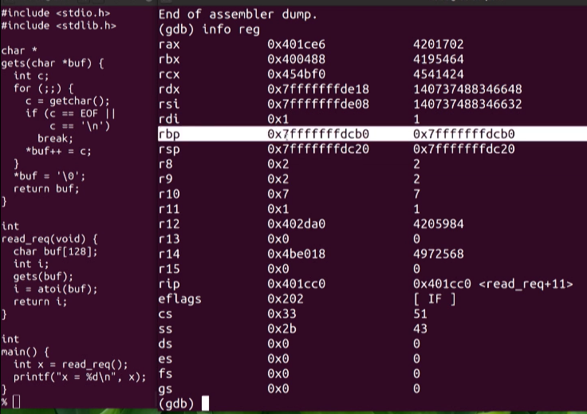
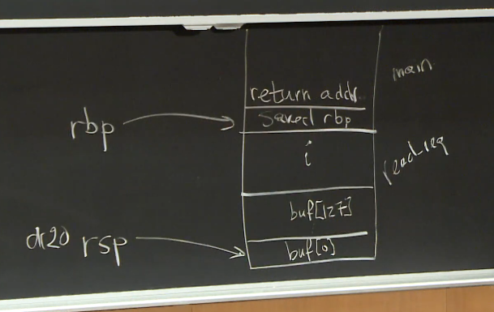
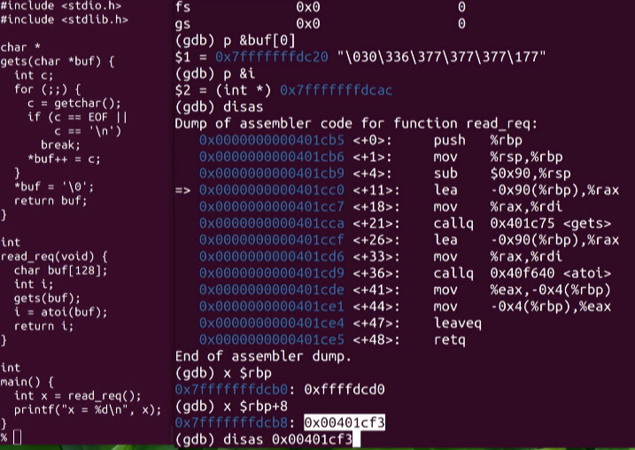
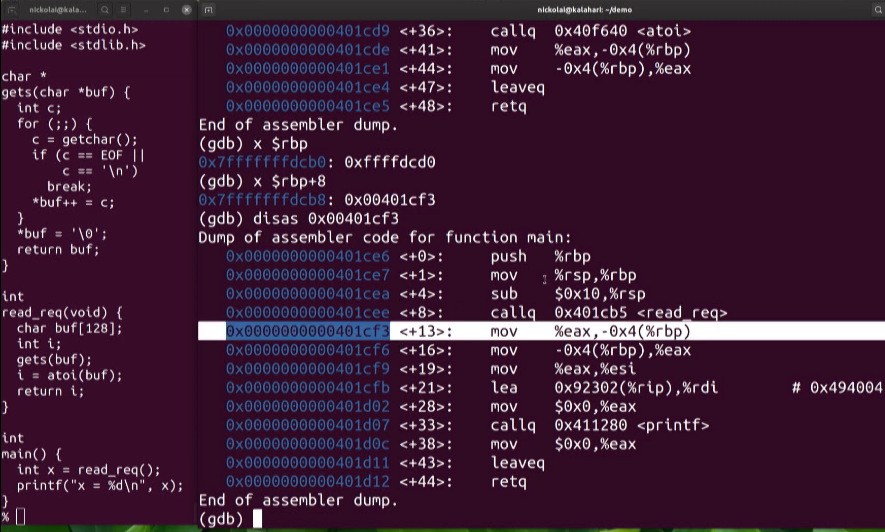
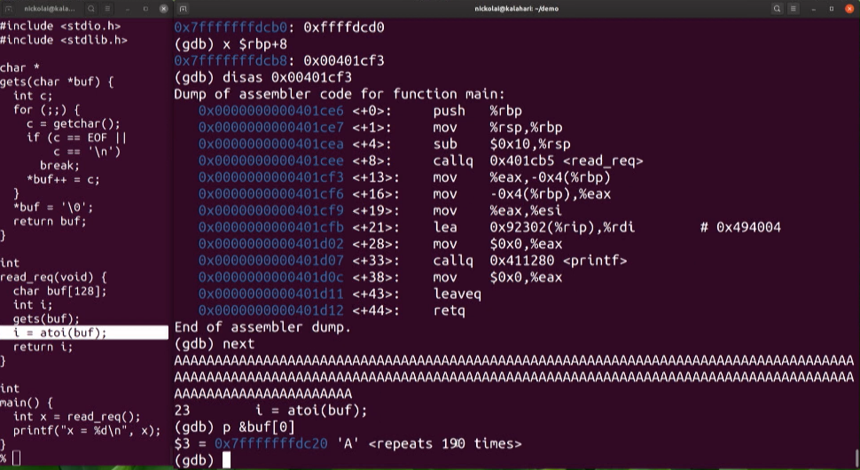
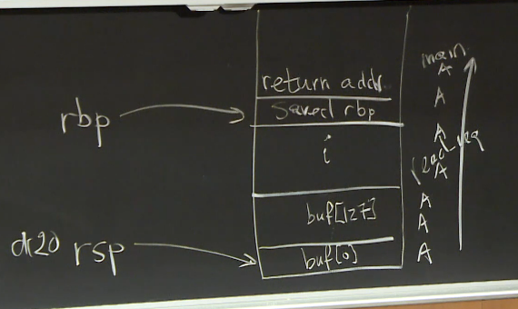
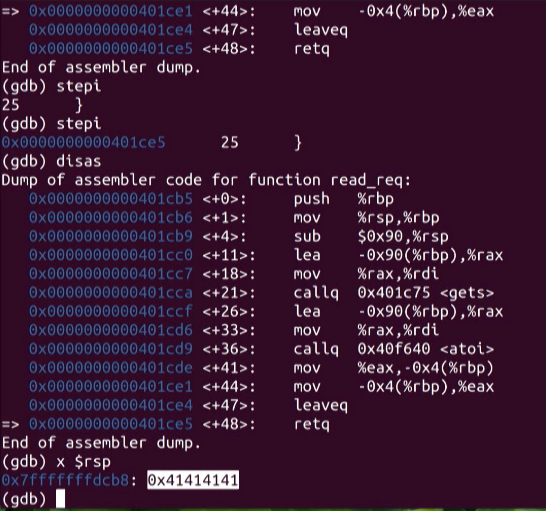

# Lecture 1 - Introduction

## Summary

My notes here will be brief. This was a high-level survey of security concerns, systems design,
policy considerations, and examples of when things go wrong. Real world policy failures and design
bugs are discussed to illustrate that weaknesses in security aren't just about software and network
configurations. In a world of interlinked and dependent services with various policy weaknesses,
it's possible that seemingly unrelated problems when combined can create unforseen failures.

Attackers are creative; security is difficult. A focus on __increased cost__ of attacks can be a
prudent approach to security. Making things costly or unrealsitic is often easier and results in
better security payoffs versus engineering or assuming perfect reliability of some security scheme.

## Buffer Overflow Demonstration

The class ends with a demonstration of a basic buffer overflow in C-code. The instructor uses `gdb`
debugger to step through the process and show the buffer being overrun:

Viewing the example stack, before buffer input:

Diagram of the stack's starting state:

As we step through, the stack grows downwards by decrementing its pointer by 90, this is because
the `read_req()` function was called, the stack grew to make room for `i` and the buffer:

This shows the current return point to `main()` for when `read_req()` completes:

We step forward to get input from the user via `gets()`, this will fill the buffer, and we
purposefully overflow, inserting 190 characters into a 128 character piece of memory:

Starting at the beginning (bottom) of the stack, the `A`'s were written direct to memory and span
outside the bounds of their intended location in the buffer:

This shows us reaching the very end of `read_req()`, just before we should be returning to `main()`.
We examine the register that should be holding our parent location in `main()`, but we see that it
holds `0x41414141` - nothing but ASCII `A`'s.

This demonstrates the core concept of a buffer overflow attack: finding weak memory-unsafe software
components that can be leveraged to insert arbitrary/unintended data into the execution environment. 
