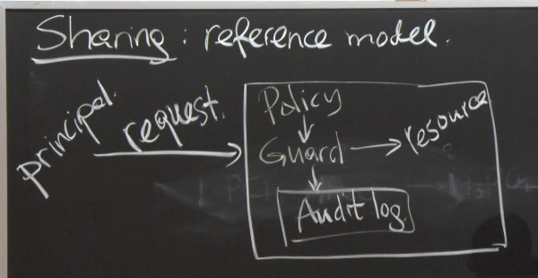

# Lecture 2 - Security Architecture

## Pre-Reading Material

 - Google Published Documentation on "Infrastructure Security Design Overview"
 - Source: https://cloud.google.com/security/infrastructure/design

## Analysis

Google's goals in the paper:

 - Defend against classes of attacks
 - Hopefully pre-empt unknown attacks
 - Contain damage should attacks occur

What they aim to protect:

 - End-User Data
 - Availability
 - Accountability

Known threats:

 - Software bugs
 - Password theft/weakness
 - Insider/employee risk (passwords, laptops, malicious intent, exposed secrets)
 - Hardware (backdoors, flaws)
 - Network (intrusion, corruption)
 - Physical (site security, rack security)

Google Front-End:

 - Accepts/handles all HTTP/S requests
 - Translates them into a google RPC protocol
  - This is a universal protocol all components of the infrastructure speak
 - Once all of the doWork() subrequests are finished, GFE handles packaging it as the HTTP/S return

## Security as a System

### Isolation

 - The Linux KVM is running managing VMs to isolate services from each other
 - Physical servers can be another boundary to enforce isolation, datacenters as well
 - Some languages offer ways to box-in their code execution

The "Reference Monitor" / "Guard" model of sharing resources:

A `principal` makes a `request` to a service. The service has a `Guard` that checks the `Policy` to
verify if `principal` has the permissions to complete their `request`. The `Guard` will then allow
or deny access to the `resource`, and also keep record of all actions to the `Audit.log`.

 - __Note__: The `Audit.log` should ideally be *isolated* into its own service environment. Should an attacker circumvent the system somehow, ideally they would be prevented from cleaning up their footprints; an example of where service isolation can strengthen a security model.

 
