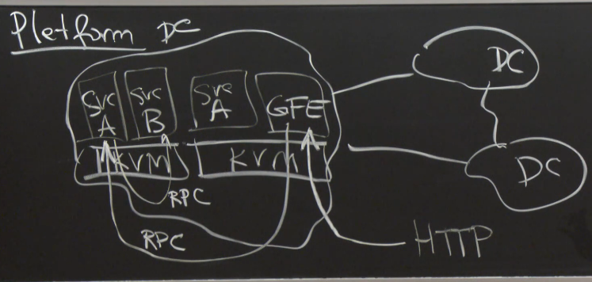
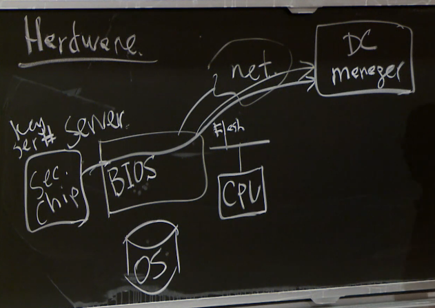

# Lecture 2 - Security Architecture

## Pre-Reading Material

 - Google Published Documentation on "Infrastructure Security Design Overview"
 - Source: https://cloud.google.com/security/infrastructure/design

## Analysis

Google's goals in the paper:

 - Defend against classes of attacks
 - Hopefully pre-empt unknown attacks
 - Contain damage should attacks occur

What they aim to protect:

 - End-User Data
 - Availability
 - Accountability

Known threats:

 - Software bugs
 - Password theft/weakness
 - Insider/employee risk (passwords, laptops, malicious intent, exposed secrets)
 - Hardware (backdoors, flaws)
 - Network (intrusion, corruption)
 - Physical (site security, rack security)

Google Front-End:

 - Accepts/handles all HTTP/S requests
 - Translates them into a google RPC protocol
  - This is a universal protocol all components of the infrastructure speak
 - Once all of the doWork() subrequests are finished, GFE handles packaging it as the HTTP/S return

## Security as a System

### Isolation

 - The Linux KVM is running managing VMs to isolate services from each other
 - Physical servers can be another boundary to enforce isolation, datacenters as well
 - Some languages offer ways to box-in their code execution

The "Reference Monitor" / "Guard" model of sharing resources:

A `principal` makes a `request` to a service. The service has a `Guard` that checks the `Policy` to
verify if `principal` has the permissions to complete their `request`. The `Guard` will then allow
or deny access to the `resource`, and also keep record of all actions to the `Audit.log`.

 - __Note__: The `Audit.log` should ideally be *isolated* into its own service environment. Should an attacker circumvent the system somehow, ideally they would be prevented from cleaning up their footprints; an example of where service isolation can strengthen a security model.

__Duties of the `Guard` box:__

 - Authentication - which user? service? machine?
  - Password
  - 2FA
  - IP Whitelisting (difficult to scale, error prone)
  - Public/Private key pairs
  - All of these require persistent data of some kind service-side, ie a table of users/ids/credentials/etc
 - Authorization - apply the policy against the auth'd party
  - `permission = Policy(principal, resource)`
  - Access Control Lists (ACLs)
 - Audit - log activity
  - Timestamp, pricipal, resource, result

 The "Gold [Au] Standard" harr harr.

### Overhead

Security infrastructure has its own performance impacts, some that Google must deal with:

 - RPC translation layers
 - Encryption
 - Centralized security services

### Granularity

 - DataCenter: Trusted inside. Firewall, IDS.
 - Service: Principle of Least Privilege
 - User: user-space services not particularly isolated, performance tradeoff?

### Hardware

Speculative model inferred from the paper. Google likely uses a secure chip on-board hardware to
validate BIOS and OS versions/hashes, to prove to its provisioning infrastructure that a given
server is authenticated as which role and identity it claims to be.

This prevents imposters or attackers from just "plugging in" to Google's network, or attempting to
insert malware into their platform firmwares.

### Availability

 - Denial-of-Service mitigation
  - Lots of resources, dynamic scaling to respond to attacks and mitigate impact
  - Increase strictness for authenticated requests (filter by `principal`)
  - Minimize resource impact/usage *before* enforcing strict authenication