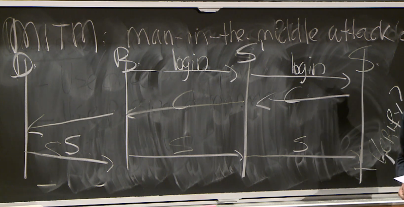

# Lecture 3 - User Authentication

## Pre-Reading Material

 - https://techcommunity.microsoft.com/t5/azure-active-directory-identity/your-pa-word-doesn-t-matter/ba-p/731984
 - https://fidoalliance.org/specs/fido-u2f-v1.2-ps-20170411/fido-u2f-overview-v1.2-ps-20170411.html

## Lecture

__User Authentication:__

 - The foundation of many security policies
 - Interesting technical issues
 - Security vs Convenience

__Standard Process:__

 - Registration
 - Auth Check
 - Recovery

__Challenges:__

 - Intermediate principals (devices, load balancer, keylogger)
 - User Identity
   - Registration is generally a very weak form of identity
 - Human factor (weak passwords, re-used credentials)

__Pro-active Password Implementation:__

 - Use password only once per session - minimize exposure & swap to stronger secret (session key)
 - Use and encourage password manager - avoid weak & re-used passwords
 - Rate limit password attempts to mitigate brute force
 - Augment passwords with 2FA

### Storing Passwords

Storing plaintext passwords is a terrible idea, so a method exists to avoid storing passwords:


Instead of storing the password itself, we use a one-way cryptographic hash function to produce
a unique hash of the password string, and store that. On the browser-side we can avoid ever sending
our plaintext password, by sending just the hash instead:

```javascript
sendCredentials(username, password, server) {
  let hash = sha256(password)
  server.login(username, hash)
}
```

This method, unfortunately, is vulnerable to __Rainbow Table__ attacks. This is a pre-built database of
common/known passwords and their hashes. When brute-forcing, the attacker simply sends the hashes
and if one works for a login, they can derive the original password. A solution to this is to add
__salt__ to the password before hashing.

Salt is just some random data appended to the input of the hash function, forcing the hash output to
be unique between services where the user may have used the same password. The same password, hashed
using different salt, will result in a different stored hash. Using this method we can thwart
Rainbow Table attacks.

### Two-Factor Authentication (2FA)

Used in conjunction with passwords to strengeth the user-auth process. 2FA helps defend against weak
passwords and phishing attacks. It requires the attacker to compromise two unique systems to get
access to a single service. Additional factors can be added to a __Multi-Factored Authentication__ (MFA)
approach.

__Approaches:__

 - Additional "code", usually: Time-based One-Time Password (TOTP)
   - SMS (weak to SIM attacks)
   - Authy (potentially weak through backup option)
   - Google Auth (no backups or transfer available)
   - Duo
 - Biological key
   - Fingerprint
   - Retina
   - Facial Recognition
 - Hardware key (private key storage device)
   - YubiKey / U2F

"Something you know", "Something you are", "Something you have".

### U2F Protocol

 - The browser `B` issues a login request to server `S`
 - Server `S` responds with challenge `C`
 - Browser `B` forwards challenge `C` directly to the device `D`
 - Device `D` signs using its private key: `Sign(priv_key, C) -> SignedMsg`
 - `SignedMsg` is forwarded back through browser to the server
 - Server `S` runs `Verify(pub_key, C, SignedMsg)`
 - If true, high confidence we know which device signed the message, and the 2FA is approved

 

### Man-in-the-Middle Attack

An impersonator gets in the middle of the communication chain and acts as a relay to lift sensitive
information. The imposter, s-prime `S'` gets in the middle:



One solution to this is to include the `origin` as part of the `challenge` sent to the 2FA. This
creates a situation where the attacker's imposter site cannot avoid sending evidence of its presence
to the validating service. The service `S` will notice that the `origin` is showing from `S'`, the
imposter, and they will deny the 2FA request.


An additional improvement can be made by including the `TLS channel id` in the signing process.