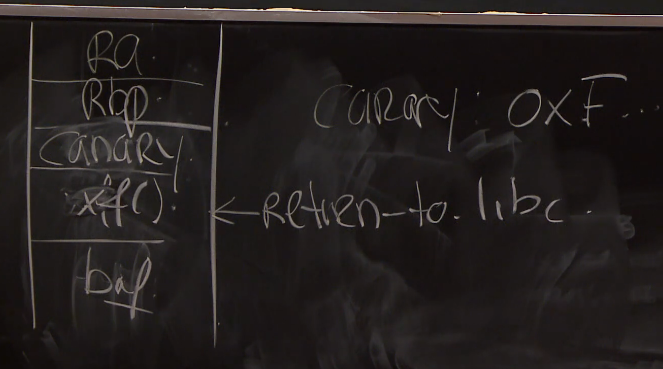

# Lecture 4 - Buffer Overflows

## Pre-Reading Material

 - http://www.css.csail.mit.edu/6.858/2020/readings/baggy.pdf
 - http://www.css.csail.mit.edu/6.858/2020/readings/baggy-errata.txt

## Lecture

This particular form of attack/vulnerability is particularly devastating as it generally allows the
attacker to inject or execute arbitrary code on the target service. There has been an evolution of
attacks and defenses against those vectors. As a result, attacks of this type have become far more
difficult to accomplish.

A prime source of these attacks is from programs and libraries written in C. Many components of
operating systems, and common distributed libraries, and programming language interpreters/compilers
are written in C. C allows low-level memory control which can lead to accidental unchecked buffers
that can end up as targets.

### Classic Buffer Overflow

Suppose we have a simple stack frame crated for the function `readpkt()` on the server:

The attacker has control of what ends up in `buf[128]`, as the server is ready to read input into
this memory space. The space `Ra` is for the return address intended to be accessed when `readpkt()`
returns. We can overrun the buffer length of `128 bytes` and replace `Ra`'s contents with a custom
return address of our own. We can use this to accomplish remote code execution by placing desired
code in the buffer space, and then choosing to call the buffer-space as our return address.

#### Defenses Against this Attack

Modern CPUs have an __NX-bit__ ie non-execute. __Memory Management Units__ (MMU) perform the task of
mapping all memory references in virtual memory to their physical addresses. This controller can be
leveraged to prevent specific pages of memory-space to be non-executable. In the case of the classic
attack, it is common to mark stack frame pages as non-executable.

#### Circumventing the NX-bit

A common small improvement to the classic attack was to change the `Ra` return address mapping to
point to a function from `libc`, namely the `exec()` function to perform system function calls. The
attack requires the buffer to be arranged in such a way that the attacker can choose which command
arguments are passed to the `exec()` call.

#### Another Defense: Stack Canaries

Insert a __canary__ segment of memory space into the stack frame during the prologue of the function
call. A function epilogue code also exists, which checks the integrity of the canary memory-space
to detect if the buffer-space has been overrun or not. In this way, it can pre-empt execution of a
malicious return address, and cease execution whenever a canary is breached.

#### Circumventing the Stack Canary

If you can manage to find a function call, which includes a function pointer in its stack frame, and
includes a call to that function for execution, you can continue a standard buffer overrun and
replace that early-return with your own call to `libc::exec()`. The key to this is careful selection
of a vulnerable function structure.

