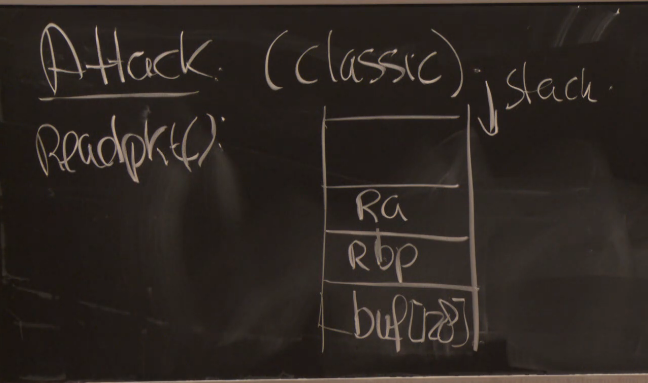

# Lecture 4 - Buffer Overflows

## Pre-Reading Material

 - http://www.css.csail.mit.edu/6.858/2020/readings/baggy.pdf
 - http://www.css.csail.mit.edu/6.858/2020/readings/baggy-errata.txt

## Lecture

This particular form of attack/vulnerability is particularly devastating as it generally allows the
attacker to inject or execute arbitrary code on the target service. There has been an evolution of
attacks and defenses against those vectors. As a result, attacks of this type have become far more
difficult to accomplish.

A prime source of these attacks is from programs and libraries written in C. Many components of
operating systems, and common distributed libraries, and programming language interpreters/compilers
are written in C. C allows low-level memory control which can lead to accidental unchecked buffers
that can end up as targets.

### Classic Buffer Overflow

Suppose we have a simple stack-frame crated for the function `readpkt()` on the server:

The attacker has control of what ends up in `buf[128]`, as the server is ready to read input into
this memory space. The space `Ra` is for the return address intended to be accessed when `readpkt()`
returns. We can overrun the buffer length of `128 bytes` and replace `Ra`'s contents with a custom
return address of our own. We can use this to accomplish remote code execution by placing desired
code in the buffer space, and then choosing to call the buffer-space as our return address.

